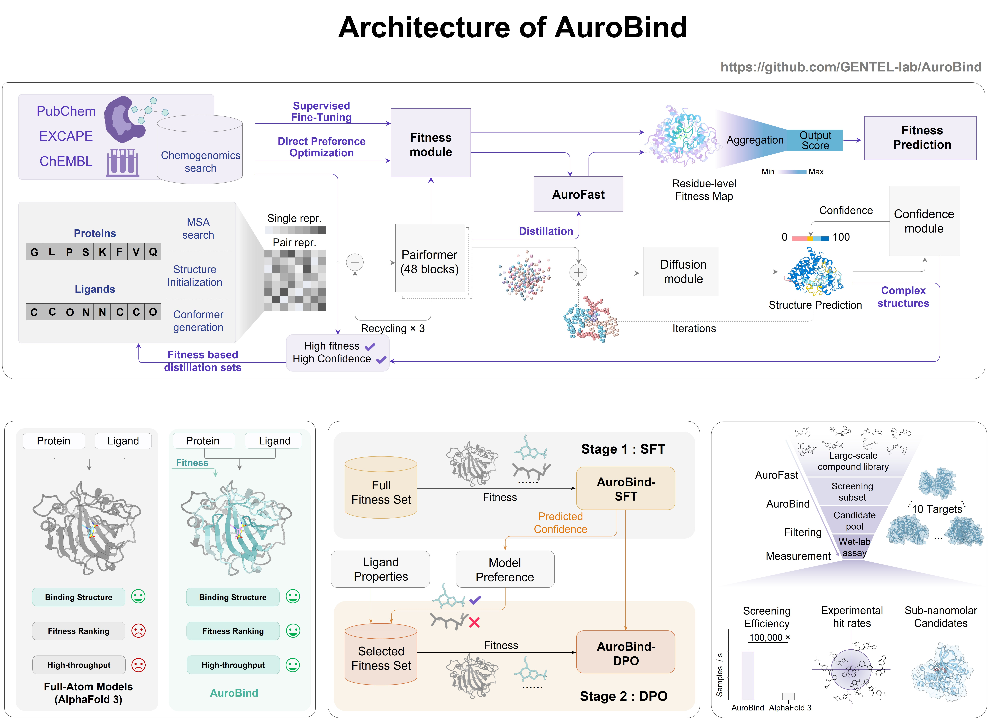

# AuroBind: **Fitness aligned structural modeling enables scalable virtual screening with AuroBind**

> **Important: Public Beta Model Notice**: The currently available AuroBind and AuroFast models are beta versions and have been trained on only 10% of our full dataset. They are intended for demonstration and preliminary testing.
> More robust and powerful models, trained on the complete dataset, will be released as our accompanying research paper moves to the next review stage. Thank you for your interest, and we look forward to your feedback!

<p align="center">
  | <a href="https://drive.google.com/drive/folders/1DNZDXewqFibbP0erslQlm6Sp0qVQG1Ad?usp=sharing">AuroBind Checkpoint</a> |
  <a href="https://drive.google.com/file/d/1v5kIyTNLUMwOg5QopL7kayzu5T5EtLXR/view?usp=sharing">AuroFast Checkpoint</a> |
</p>

## 1. Aurobind Overview

AuroBind is a fitness-aligned structural modeling method designed for high-throughput virtual screening. It takes protein sequences and small molecule SMILES as direct inputs to predict their complex's fitness score, while also supporting structure prediction and confidence scoring.

## 2. Getting Started
### Inference
We provide two models for inference: the standard `AuroBind` and the lightweight `AuroFast`.

**AuroBind**
1. **Prepare Input File**: Create a YAML file with your sequences following ./examples/5S8I_A.yaml

2. **Download Data and Model**: You can download from [google drive](https://drive.google.com/drive/folders/1DNZDXewqFibbP0erslQlm6Sp0qVQG1Ad?usp=sharing)
   > Please note, this model was trained on only 10% of the full dataset.

3. **Installation and demo**:

   ```bash
   cd src
   conda env create -f environment.yaml
   conda activate aurobind
   bash predict.sh
   ```
   
**Lightweight model:AuroFast**

We provide a Jupyter Notebook demo for using AuroFast to perform inference on 10 targets.

**1. Download Required Files:**
To run the demo, Please download the demo trunk [here](https://drive.google.com/file/d/12pIDDCL7eOgTea0pLFrcTyx1qPCC9gpk/view?usp=sharing), and AuroFast model checkpoints [here](https://drive.google.com/file/d/1v5kIyTNLUMwOg5QopL7kayzu5T5EtLXR/view?usp=sharing).
   > Please note, this model was also trained on only 10% of the full dataset.

**2. File Placement:**
Unzip the downloaded files and place them in the src/AuraFast folder.

**3. Run Demo:**
Open and execute
```
inference_aurafast_demo.ipynb
```
This will generate predictions for the input file `demo_input.csv`, and the results will be saved in `inference_result.csv`.
To obtain additional features_fast_X.pt files, please run the full AuroBind pipeline.

## 3. Acknowledgements

- The implementation of **fast layernorm operators** is inspired by [OneFlow](https://github.com/Oneflow-Inc/oneflow) and [FastFold](https://github.com/hpcaitech/FastFold), following [Protenix](https://github.com/bytedance/Protenix)'s usage. 
- Many components are adapted from [OpenFold](https://github.com/aqlaboratory/openfold), with substantial modifications and improvements by our team (except for the `LayerNorm` part).  
- This repository implements the Inference Data Pipeline (including data/feature processing and MSA generation), with conceptual inspiration from related tools such as [Boltz-1](https://github.com/jwohlwend/boltz), and selected code components adapted from [IntelliFold](https://github.com/IntelliGen-AI/IntelliFold).


## 4. License

This code repository is licensed under [the Creative Commons Attribution-Non-Commercial ShareAlike International License, Version 4.0 (CC-BY-NC-SA 4.0)](https://creativecommons.org/licenses/by-nc-sa/4.0/) (the "License"); you may not use this file except in compliance with the License. You may obtain a copy of the License at https://github.com/GENTEL-lab/AuroBind/blob/main/LICENSE.


