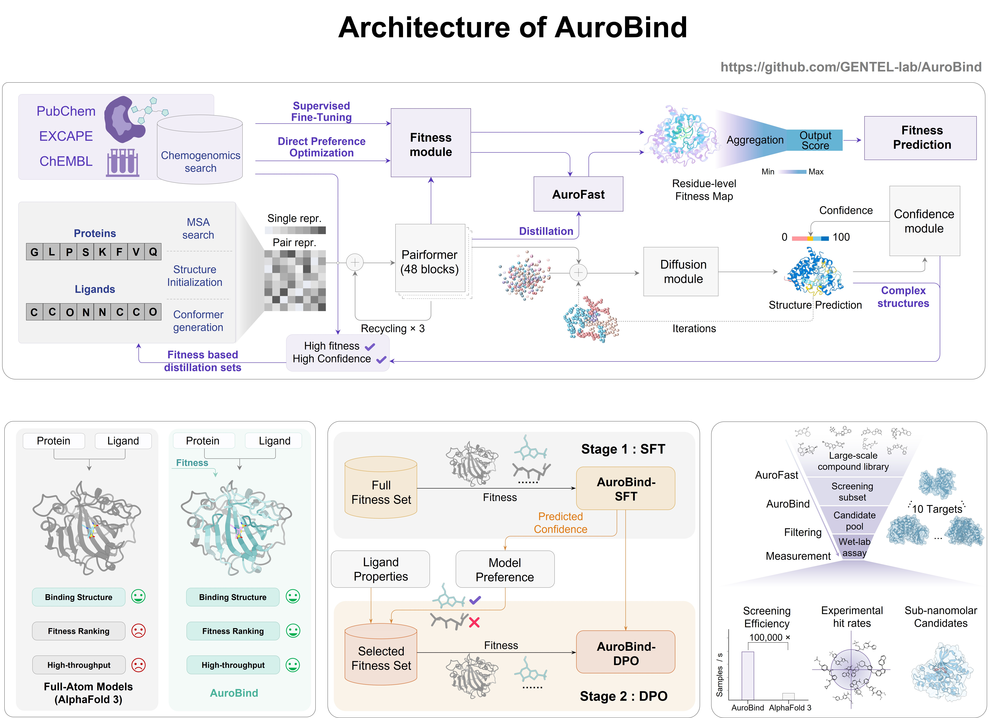

# AuroBind: **Fitness aligned structural modeling enables scalable virtual screening with AuroBind**

<p align="center">
  | <a href="https://drive.google.com/drive/folders/1DNZDXewqFibbP0erslQlm6Sp0qVQG1Ad?usp=sharing">AuroBind Checkpoint</a> |
  <a href="https://drive.google.com/file/d/1v5kIyTNLUMwOg5QopL7kayzu5T5EtLXR/view?usp=sharing">AuroFast Checkpoint</a> |
</p>

## 1. Aurobind Overview

AuroBind is a fitness-aligned structural modeling method designed for high-throughput virtual screening. It takes protein sequences and small molecule SMILES as direct inputs to predict their complex's fitness score, while also supporting structure prediction and confidence scoring.

We provide two models for inference: the standard `AuroBind` and the lightweight `AuroFast`.
**An A100 80GB or higher-memory GPU is recommended for standard model**

## 2. Recommended usage: Docker (no manual environment setup)

### Download image
The image is now publicly available on：[google drive](https://drive.google.com/drive/folders/15HtUqnWR-HaYPo8zOUMGL6eJxcSdAVT1?usp=drive_link)

### Load docker image
```
docker load -i aurobind_docker_v1.tar.gz 
```

### Run prediction
```
source /root/miniconda/bin/activate aurobind
cd /root/AuroBind_code_with_docker/src
```

### Run a quick inference example for AuroBind
```
bash predict.sh 
```

### Output
Predictions will be saved to:
./output/5S8I_A/predictions

### Run Lightweight model:AuroFast with Docker
```
cd aurofast
python inference_aurofast_demo.py
```
This will generate predictions for the input file `demo_input.csv`, and the results will be saved in `inference_result.csv`.
To obtain additional features_fast_X.pt files, please run the full AuroBind pipeline.


## 3. Optional: Native installation from source (conda)

### Inference
**AuroBind**

**1. Prepare Input File**: Create a YAML file with your sequences following ./examples/5S8I_A.yaml

**2. Download Data and Model**: You can download from [google drive](https://drive.google.com/drive/folders/1DNZDXewqFibbP0erslQlm6Sp0qVQG1Ad?usp=sharing)

**3. Installation and demo**:

   ```bash
   cd src
   conda env create -f environment.yaml
   conda activate aurobind
   bash predict.sh
   ```
   
**Lightweight model:AuroFast**

We provide a Jupyter Notebook demo for using AuroFast to perform inference on 10 targets.

**1. Download Required Files:**
To run the demo, Please download the demo trunk [here](https://drive.google.com/drive/folders/1SztEkVRMsbRlVFYv9S_2bGOmKkkqh_Nj?usp=sharing), and AuroFast model checkpoints [here](https://drive.google.com/file/d/1v5kIyTNLUMwOg5QopL7kayzu5T5EtLXR/view?usp=sharing).

**2. File Placement:**
Unzip the downloaded files and place them in the src/aurofast folder.

**3. Run Demo:**
Open and execute
```
inference_aurofast_demo.ipynb
```
This will generate predictions for the input file `demo_input.csv`, and the results will be saved in `inference_result.csv`.
To obtain additional features_fast_X.pt files, please run the full AuroBind pipeline.

## 4. Acknowledgements

- The implementation of **fast layernorm operators** is inspired by [OneFlow](https://github.com/Oneflow-Inc/oneflow) and [FastFold](https://github.com/hpcaitech/FastFold), following [Protenix](https://github.com/bytedance/Protenix)'s usage. 
- Many components are adapted from [OpenFold](https://github.com/aqlaboratory/openfold), with substantial modifications and improvements by our team (except for the `LayerNorm` part).  
- This repository implements the Inference Data Pipeline (including data/feature processing and MSA generation) drawing conceptual inspiration and selectively reusing code components from [IntelliFold](https://github.com/IntelliGen-AI/IntelliFold).


## 5. License

This code repository is licensed under [the Creative Commons Attribution-Non-Commercial ShareAlike International License, Version 4.0 (CC-BY-NC-SA 4.0)](https://creativecommons.org/licenses/by-nc-sa/4.0/) (the "License"); you may not use this file except in compliance with the License. You may obtain a copy of the License at https://github.com/GENTEL-lab/AuroBind/blob/main/LICENSE.


